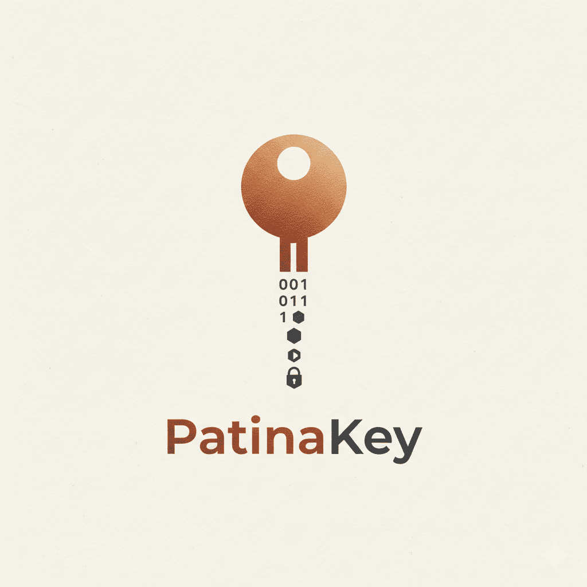

# PatinaKey

**An open and fully auditable hardware security key.**
Copper for the board, Rust for the firmware.

---

## The project

PatinaKey is a **USB security key** I'm designing from scratch, fully open : from the schematic all the way down to the silicon.

The name comes from two kinds of oxidation. Just as **rust** is the oxidation of iron, a **patina** is the oxidation of **copper**. A metaphor for the deep link between our physical medium (the copper board) and our memory-safe software (the Rust firmware).

The goal: a **transparent** root of trust, with no black boxes : reproducible and verifiable by anyone.

## Architecture

| Block | Choice | Why |
|---|---|---|
| Secure element | **TROPIC01** (Tropic Square) | The first truly open-source, auditable secure element. Anti-brute-force PIN (MAC-and-Destroy), TRNG, PUF. |
| Microcontroller | **STM32U545** | Secure Cortex-M33, full-speed USB, very power-efficient. |
| Firmware | **Rust** 🦀 | Memory safety by design. The right tool for security code. |
| Interface | **USB-A** gold fingers | The board *is* the plug. ENIG finish + 30° bevel. |
| Interaction | Touch + LED | Confirm an action with a single touch, no moving parts. |
| PCB | **4 layers**, 49.3 × 18.6 mm | Clean ground plane, capped vias under the chips. |

## Repositories

| Repo | Contents |
|---|---|
| [`hardware`](https://github.com/PatinaKey/hardware) | Altium sources, Gerbers, BOM, renders, manufacturing notes. |
| [`firmware`](https://github.com/PatinaKey/firmware) | The Rust firmware (work in progress). |

## Status

- ✅ Schematic & 4-layer PCB routing
- ✅ Clean DRC + manufacturing files
- 🔶 First prototypes on order (JLCPCB)
- ⬜ Rust firmware
- 💡 v2: on-device screen + PIN entry

---

Personal open-source project · crafted with copper and rust, 2026 · <a href="https://patinakey.fr">patinakey.fr</a>

